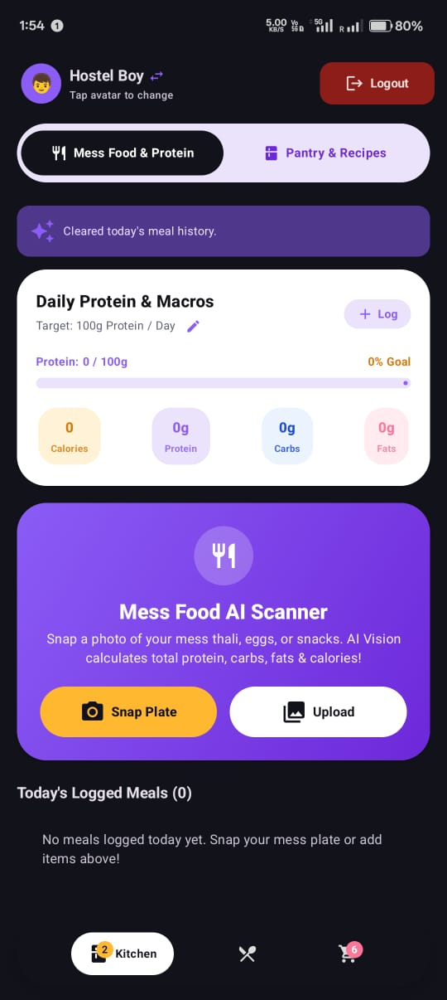
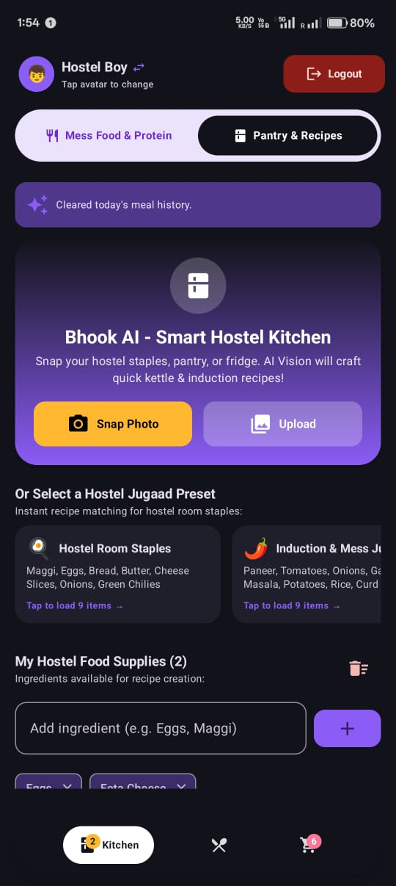
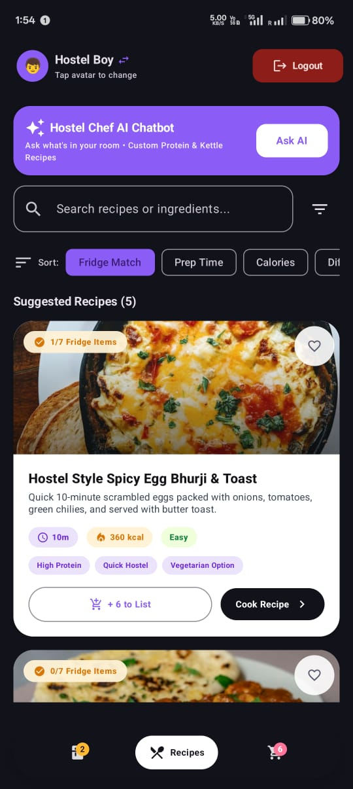
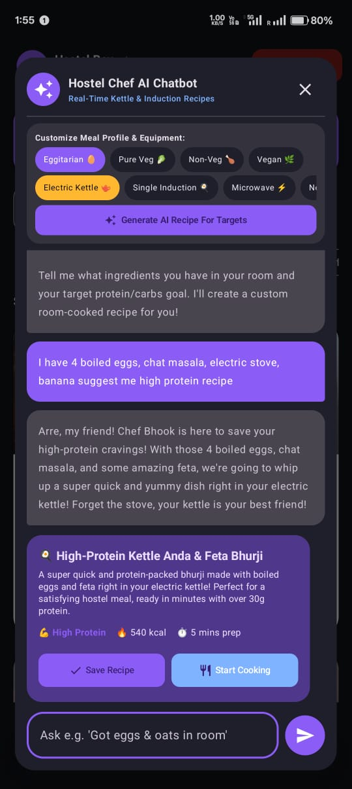
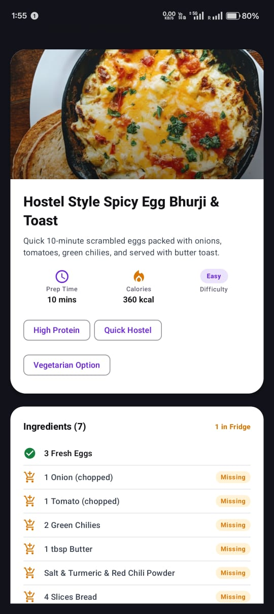
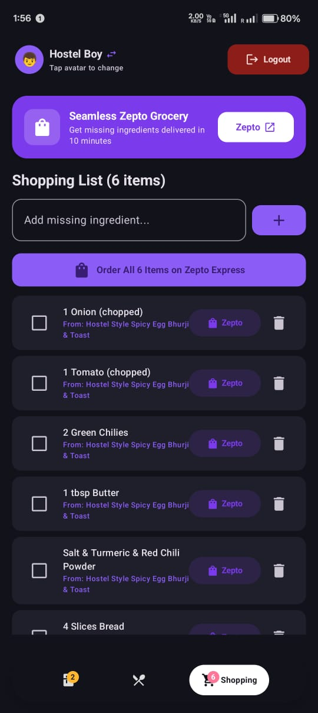
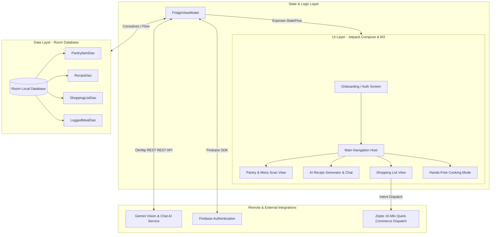

# Bhook AI - Smart Hostel Kitchen & Mess Protein AI

> **The Ultimate AI Culinary & Macro-Tracking Companion Engineered for Indian Hostel Students**

[](https://kotlinlang.org)
[](https://developer.android.com/jetpack/compose)
[](https://m3.material.io)
[](https://ai.google.dev)
[](https://firebase.google.com)
[](https://developer.android.com/training/data-storage/room)

---

### The Problem
Living in an Indian college hostel comes with unique daily survival challenges:
* **The Mess Food Gamble**: Hostel mess thalis are unpredictable, often low in protein, and completely lack nutritional transparency. Students aiming for fitness goals struggle to estimate their daily macro intake.
* **Severe Equipment Constraints**: Hostel rooms don't have full kitchens. Cooking is restricted to **Electric Kettles**, **Microwave Ovens**, or **Single-Burner Inductions** — standard recipes online simply don't apply.
* **Ingredient Wastage & Refill Friction**: Students often have random leftover items (eggs, oats, Maggi, peanut butter) in their dorms but don't know what to make, or they run out of basic groceries right when hunger strikes late at night.

### The Solution
**Bhook** is an all-in-one AI-driven Android application custom-crafted for hostel life:
1. **Mess Thali AI Vision Scanner**: Instant photo analysis of hostel plates extracting total **Protein (g)**, **Carbs (g)**, **Fats (g)**, and **Calories**, accompanied by budget-friendly hostel protein add-on advice.
2. **Room Equipment Cooking Engine**: Generate delicious recipes optimized specifically for Electric Kettles, Microwaves, or Inductions using only the ingredients available in your dorm room.
3. **Zepto Express 10-Min Refills**: One-tap synchronization that transfers missing recipe ingredients directly into a Zepto delivery cart.
4. **Offline Local Storage**: Full Room DB integration for meal logging, pantry tracking, and recipe collections.

---
## App Preview

<div align="center">

<table>
  <tr>
    <td align="center"><br/></td>
    <td align="center"><br/></td>
    <td align="center"><br/></td>
  </tr>
  <tr>
    <td align="center"><br/></td>
    <td align="center"><br/></td>
    <td align="center"><br/></td>
  </tr>
</table>

</div>

## Architecture & System Flow

The app follows modern Android **Clean Architecture** with MVVM (Model-View-ViewModel), leveraging Kotlin Coroutines and Flows for real-time reactive UI updates.




---

## Key Features & User Experience

### 1. Mess Plate Protein AI Scanner
* **AI Vision Analysis**: Snap or upload a photo of your mess thali, egg bhurji, or hostel snack.
* **Instant Macro Extraction**: Real-time identification of protein, carbohydrates, fats, and overall calories.
* **Smart Hostel Nutrition Tips**: Provides actionable, cheap protein recommendations (e.g., *"Add 2 boiled eggs or a cup of curd to hit your 35g protein target"*).
* **Daily Macro Logging**: Persists scanned meals directly to your daily fitness log in Room DB.

### 2. Hostel Chef AI Chatbot
* **Room-Specific Ingredient Prompting**: Input available items (e.g., Maggi, oats, peanut butter, cheese, eggs).
* **Appliance Filters**: Select your appliance constraint — **Electric Kettle**, **Induction**, **Microwave**, or **No-Cook**.
* **Dietary Preferences**: Supports `Pure Veg 🥬`, `Eggitarian 🥚`, and high-protein filters (`25g+ Protein 💪`).
* **One-Tap Recipe Storage**: Save custom recipes directly to your personal offline database.

### 3. Zepto Express 10-Min Grocery Integration
* **Missing Ingredient Sync**: Automatically calculates ingredient gaps between selected recipes and current room stock.
* **Instant Cart Dispatch**: One-tap button formatting items for 10-minute delivery via Zepto.

### 4. Hands-Free Step-by-Step Cooking Mode
* **Step Progression**: Clear, high-legibility cards formatted for easy reading while cooking in a small dorm space.
* **Interactive Timers**: Integrated countdown timers with audio notifications.
* **Progress Checklist**: Interactive step completion indicators.

---

## Color Palette & Design Tokens

Designed with a high-contrast **Dark Espresso & Warm Amber** palette optimized for late-night hostel study and cooking sessions:

| Token | Color Code | Description |
|---|---|---|
| **Dark Espresso Canvas** | `#1A0D0A` | Deep dark background canvas for reduced glare |
| **Warm Amber Primary** | `#DC8E47` | High-visibility primary action buttons & accents |
| **Emerald Primary** | `#00C853` | Nutrition badges, protein indicators & success states |
| **Sky Cyan Accent** | `#3AC9FA` | AI Vision scan highlights and secondary tags |
| **Royal Indigo Card** | `#6352CA` | Hero gradient backgrounds for feature spotlighting |

---

## Tech Stack & Dependencies

* **Language**: 100% [Kotlin](https://kotlinlang.org/)
* **UI Framework**: [Jetpack Compose](https://developer.android.com/jetpack/compose) with [Material Design 3](https://m3.material.io/)
* **Architecture**: MVVM + Clean Architecture + Reactive Streams (`StateFlow`, `SharedFlow`)
* **Local Persistence**: [Room Database](https://developer.android.com/training/data-storage/room) with KSP (Kotlin Symbol Processing)
* **AI Integration**: Custom OkHttp REST service targeting Google Gemini API (`gemini-2.5-flash`, `gemini-1.5-flash`, `gemini-2.0-flash` with model fallback rotation)
* **Authentication**: [Firebase Authentication](https://firebase.google.com/docs/auth) (Email/Password & Session Persistence)
* **Image Loading**: [Coil Compose](https://coil-kt.github.io/coil/)
* **Build System**: Gradle (Kotlin DSL `.gradle.kts`) with Secrets Gradle Plugin

---

## Building & Setup Instructions

### Prerequisites
* **Android Studio**: Ladybug (2024.2.1) or newer
* **JDK**: Version 11 or higher
* **Android SDK**: API Level 35 (Android 15)

### Step-by-Step Installation

1. **Clone the Repository**
   ```bash
   git clone https://github.com/harsh-singh-2023/bhook-mobile-app.git
   cd bhook-mobile-app
   ```

2. **Configure Environment Variables**
   Create or edit the `.env` file in the project root directory:
   ```env
   # Gemini API Key for Mess Thali Vision & AI Chatbot
   GEMINI_API_KEY=your_gemini_api_key_here
   ```

3. **Firebase Configuration**
   Ensure `google-services.json` is present in the `app/` directory:
   ```path
   app/google-services.json
   ```

4. **Build the Project**
   Run a full debug assemble using Gradle:
   ```bash
   ./gradlew assembleDebug
   ```

5. **Run on Emulator / Device**
   Install and run the debug APK on an Android device running Android 7.0 (API 24) or higher.

---

## License & Credits

Built with ❤️ for Indian hostel students to make dorm life healthier, easier, and protein-packed.
